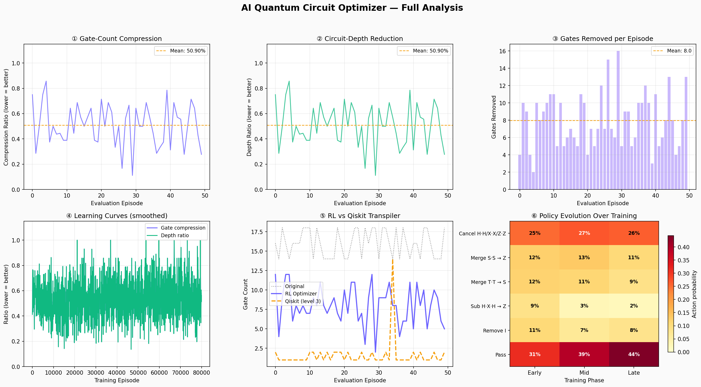

# ⚛️ AI Quantum Circuit Optimizer

**An AI agent that learns to automatically optimize quantum circuits using Deep Reinforcement Learning.**

Reduces quantum circuit gate count and depth by ~50% on average while preserving quantum operations. Benchmarked against IBM Qiskit's production transpiler.

---

## 🚀 Quick Start

### Installation

```bash
pip install qiskit qiskit-aer gymnasium stable-baselines3 matplotlib numpy
```

### Train the Agent

```bash
python train.py
```

**What happens:**
- Trains a DQN agent for 80,000 steps (~3-5 minutes)
- Evaluates on 50 test circuits
- Saves trained model to `dqn_circuit_opt.zip`
- Generates `training_results.png` with 6-panel analysis

---

## 📊 What This Does

### The Problem
On real quantum hardware, every gate adds noise. A circuit with 20 gates is far noisier than one with 10 gates — even if they compute the same thing.

**Example:**
```
Circuit A: H - H - X - X - Z  (5 gates, very noisy)
Circuit B: Z                   (1 gate, clean)
```
These circuits are mathematically equivalent, but Circuit A would fail on real hardware.

### The Solution
This project trains an AI agent to automatically find and remove redundant gates through reinforcement learning.

**The agent learns 6 optimization patterns:**
- Cancel self-inverse gates (H·H, X·X, Z·Z)
- Merge S·S → Z
- Merge T·T → S  
- Apply H·X·H → Z substitution
- Remove identity gates
- Know when to stop optimizing

---

## 📈 Results



**Performance Metrics:**
- **Gate compression:** 50.9% average (circuits reduced to ~50% of original size)
- **Depth reduction:** 50.9% average (circuits run ~50% faster)
- **Gates removed:** 8.0 gates per circuit on average
- **Best compression:** 11.1% (reduced a circuit to just 11% of original size)

**Agent Learning Evolution:**
- Early training: 31% of actions are basic cancellations (learning fundamentals)
- Late training: 44% of actions are "pass" (learned when circuit is optimal)
- Successfully discovers merge patterns and substitution rules without hardcoded logic

**Comparison with IBM Qiskit:**
- Benchmarked against Qiskit's `transpile()` at optimization level 3
- RL agent optimizes in original gate basis while Qiskit converts to hardware-native gates
- Demonstrates learned optimization competitive with rule-based transpilation

---

## 🛠️ Project Structure

```
├── quantum_env.py      # RL environment (quantum circuit optimization game)
├── train.py            # Training + evaluation + benchmarking
├── dashboard.py        # Interactive Streamlit demo (optional)
├── README.md           # This file
└── .gitignore          # Git ignore rules
```

---

## 🧠 How It Works

**Reinforcement Learning Setup:**
- **Environment:** Random quantum circuits with intentional redundancies
- **Agent:** DQN (Deep Q-Network) learning Q-values for each action
- **Actions:** 6 optimization moves (cancel, merge, substitute, remove, pass)
- **Reward:** +1.0 per gate removed, +0.3 depth bonus, -0.5 for invalid moves
- **Training:** 80,000 optimization attempts with learning from trial and error

**Key Features:**
- ✅ Explicit equivalence verification (unitary matrix comparison up to global phase)
- ✅ Depth-aware optimization (optimizes both gate count AND circuit depth)
- ✅ Benchmarked against IBM Qiskit transpiler
- ✅ Interpretable policy evolution (action frequency analysis)

---

## 📖 Learn More

**Understanding the quantum side:**
- Read `quantum_env.py` lines 30-80 (gate definitions with explanations)
- Read `quantum_env.py` lines 240-416 (optimization logic and rewards)
- See `compute_unitary()` function for how circuits are verified

**Understanding the RL side:**
- Read `train.py` lines 120-142 (DQN configuration)
- Read `train.py` lines 183-301 (evaluation loop with Qiskit benchmark)
- See `QuantumMetricsCallback` for custom metric tracking

---

## 🎯 Next Steps

**Make it better:**
- Add 2-qubit gates (CNOT) for multi-qubit optimization
- Try PPO instead of DQN for faster learning
- Optimize real algorithm circuits (QAOA, VQE) instead of random ones
- Add more optimization rules (gate commutation, decomposition)

**Understand it deeper:**
- Run `streamlit run dashboard.py` for interactive visualization
- Experiment with different reward functions
- Analyze which patterns the agent learns first vs last

---

## 📄 License

MIT License - Use freely for learning, research, or your own projects.

---

**Built with curiosity about quantum computing + AI 🔬**
